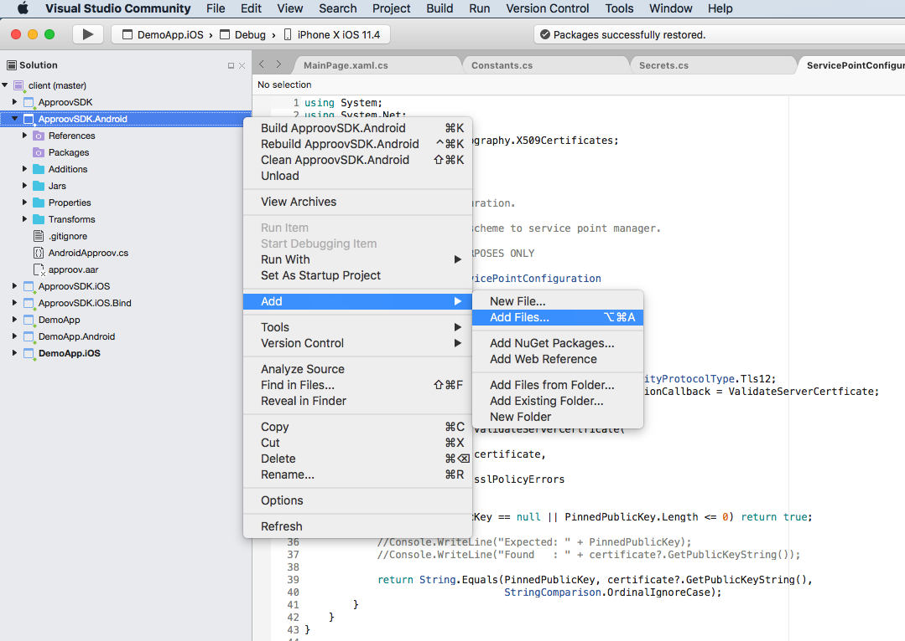

The Xamarin Approov SDK enables Xamarin apps to use Approov native Android and iOS libraries.

This repository contains the main ApproovSDK project along with its Android and iOS platform specific projects and an example Xamarin demo app which runs on Android and iOS platforms.

Building the Approov SDK demo app will help in understandanding the Xamarin Approov SDK integration flow. Follow these steps:

- [Approov Library Binding](#approov-library-binding)
- [Approov Library Initialization](#approov-library-initialization)
- [Approov App Atteststation](#approov-app-attestation)
- [Approov App Registration](#approov-app-registration)
- [Certificate Pinning](#certificate-pinning)

Once you understand the flow, you can repeat this process with your own Approov library and Xamarin applications.

# Xamarin Solution

The Xamarin solution contains multiple projects:

- DemoApp
- DemoApp.Android
- DemoApp.iOS
- ApproovSDK
- ApproovSDK.Android
- ApproovSDK.iOS
- ApproovSDK.iOS.Binding

The sample Xamarin Demo App is built from the `DemoApp` directories. All calls to attest the app and fetch an Approov token are made from the platform-independent `DemoApp` project.

The corresponding platform-specific `DemoApp.Android` and `DemoApp.iOS` projects require a small addition to initialize the appropriate Approov library when the app starts.

The Approov API is exposed through the platform-independent `ApproovSDK` project. The corresponding platform-specific Android and iOS projects are only called by the appropriate platform-specific app projects during initialization.

# Xamarin Demo App

This project demonstrates a Xamarin client with Approov integration.

The client app has `HELLO` and `SHAPE` buutons. When the `HELLO` button is pressed,
a smiley face is displayed if an HTTP connection to the Approov demo server is successful.


The Xamarin demo app uses the download demo's backend server, the Android and iOS Approov libraries, 
and the Approov registration tools. The download demo's clients are not used.

# The Demo Back-end Server

The Shapes demo server is very simple, you can access it at https://demo-server.approovr.io/.
It has 2 endpoints:

- A Hello endpoint (https://demo-server.approovr.io/hello) that returns 'Hello, World!'
- A Shapes endpoint (https://demo-server.approovr.io/shapes) that returns a random shape

The Hello endpoint is not protected by Approov,  so you can freely access it, for example, using curl:

```
$ curl -D- https://demo-server.approovr.io/hello
HTTP/1.0 200 OK
Content-Type: text/html; charset=utf-8
Content-Length: 12
Server: Werkzeug/0.11.15 Python/3.4.3
Date: Tue, 31 Jan 2017 23:38:52 GMT

Hello World!
```

The Shapes endpoint is protected by Approov and expects a valid Approov token. If you try to access
it using curl without the correct Approov header, or with a header that contains an
invalid token, you will get a 400 response:

```
$ curl -D- https://demo-server.approovr.io/shapes
HTTP/1.0 400 BAD REQUEST
Content-Type: text/html
Content-Length: 192
Server: Werkzeug/0.11.15 Python/3.4.3
Date: Tue, 31 Jan 2017 23:43:40 GMT

<!DOCTYPE HTML PUBLIC "-//W3C//DTD HTML 3.2 Final//EN">
<title>400 Bad Request</title>
<h1>Bad Request</h1>
<p>The browser (or proxy) sent a request that this server could not
understand.</p>
```

# Approov Library Binding

Native Approov libraries are required for Android and iOS platforms. Libraries are unique for each customer and the downloadable demo, so your specific libraries need to be bound to the Xamarin environment.

To work the demo app, you will need to download the Approov Demo package at [approov.io](https://approov.io). 
See the demo download README.md file for more information.

Most of the library binding work has already been done, but your specific Android and iOS native libraries need to be added to the appropriate projects.

## Android Library Binding

The Android Approov library is provided as an Android archive (.aar) bundle. Add the bundle to the `ApproovSDK.Android` project. In the Visual Studio IDE, right-click on the `ApproovSDK.Android` project and add your `approov.aar` bundle:



Make sure that the bundle is copied into the project.

## iOS Library Binding

For iOS, the Approov library is provided as a zip archive. Unzip the archive to create the `Approov.Framework` directory. Add this directory of files to the `ApproovSDK.iOS.Bind` project. In the Visual Studio IDE, right-click on the `ApproovSDK..iOS.Bind` project and add your `Approov.framework` directory:


Make sure that the directory of files is copied into the project.

Everything should be set, but check that the Approov fat binary within the Approov framework is set as a native reference, or set it if necessary.

# Approov Library Initialization

The platform-specific `XamarinApproov` library must be initialized before any platform-independent API calls are made.

## Android Library Initialization

For Android, the Approov library is initialized by adding to the `Application` object. In the Android demo app project, `DemoApp.Android`, in the `Application` class, in the `OnCreate()` method, an `AndroidApproov` object is created and assigned to the `Shared` singleton in the platform-independent `Approov` class:

```
public override void OnCreate()
{
    base.OnCreate();

    // Set up shared Android Approover
    Approov.Shared = new AndroidApproov(this.ApplicationContext);
}
```

If initializing in your own app, create an application class if necessary, and assign the shared `AndroidApproov` instance.

## iOS Library Initialization

For iOS, the Approov library is initialized by adding to the app delegate. In the iOS demo app project, `DemoApp.iOS`, in the `AppDelegate` class, in the `FinishedLaunching()` method, an `iOSApproov` object is created and assigned to the `Shared` singleton in the platform-independent `Approov` class:

```
public override bool FinishedLaunching(UIApplication app, NSDictionary options)
{
    global::Xamarin.Forms.Forms.Init();
    LoadApplication(new App());

    Approov.Shared = new IosApproov();

    return base.FinishedLaunching(app, options);
}
```

If initializing in your own app, create an application class if necessary, and assign the shared `iOSApproov` instance.

# Approov App Attestation

Attestation is managed through calls to the shared instance of the platform-independent abstract `Approov` class.

## `public abstract class Approov`

Concrete Android and iOS Approov classes implement the abstract methods by interfacing to the appropriate bound native libraries.

### `public static Approov Shared`

Approov singleton.

This instance points to a platform-specific implementation which should be created when the app starts up.

### `public static bool IsErrorToken(string token)`

Returns true if token is an error token.

 * **Parameters:** `token` — A token string.
 * **Returns:** True if token is null or is an error token value.

### `public abstract string FetchToken(string url)`

Fetches a token from the Approov cloud service.

This function blocks until a token is returned.

 * **Parameters:** `url` — The URL of the connection to be protected by Approov

     or null if no protection is desired.
 * **Returns:** A token string.

### `public abstract Task<string> FetchTokenAsync(string url = null)`

Fetches a token asynchronously from the Approov cloud service.

This function returns a task which returns a token when complete.

 * **Parameters:** `url` — The URL of the connection to be protected by Approov

     or null if no protection is desired.
 * **Returns:** A task which returns a token string once completed.

### `public abstract byte[] GetCert(string url)`

Retrieves the X.509 TLS leaf certificate in DER binary format for the given URL.

The fetchToken() or fetchTokenAsync() method should be invoked with the same URL prior to invoking this method.

 * **Parameters:** `url` — URL of the connection protected by Approov.
 * **Returns:** The certificate data, or null if the connection to the 

     given URL has not been retrieved by Approov.

### `public abstract void ClearCerts()`

Clears the internal cache of X.509 TLS leaf certificates retrieved by Approov. This should be called if you suspect that the certificate information stored is incorrect, either as a result of communication with your server or a miss-match in the certificates obtained by calling getCert and comparing the answer to your connection's certificate.

 * **Returns:** Nothing.

## Attestation Calls

The `Approov` class contains two API calls to attest and fetch an Approov token, synchronous and asynchronous.

The synchronous `Approov.FetchToken(string url)` method blocks until a token is fetched.

The method returns an Approov token as a string. The `IsErrorToken(token)` method should be used to check for failure to receive a token from the Approov attestation service.

The `url` should contain the domain targeted by the proetcted API endpoint to add dynamic man-in-the-middle protection. If `null`, no dynamic protection is used. See the [Approov docs](https://approov.io/docs/) for more information. Synchronous calls should not be used on the main UI thread.

The asynchronous `Approov.FetchTokenAsync(string url)` method is run as a separate `Task`. The method returns a `Task<string>` object, and the token string can be read from the task when the task completes. A typical usage is:

```
// fetch approov token
string token = await Approov.Shared.FetchTokenAsync(url);

// check token fetch success
if (Approov.IsErrorToken(token)
{
    // take corrective action, or continue and send the error token
    // to backend to notify service of failure
}

// add approov token header to request
request.Headers.Add("Approov-Token", token);

...
```

## Approov Interceptor

The `ApproovHandler` class is included as an example of a `DelegatingHandler` for an `HttpClient`. The sample intercepts client request calls, fetches an Approov token, and adds it to the request's headers. A typical usage is:

```
private const string shapeUrl = "https://demo-server.approovr.io/shapes";

private readonly HttpClient shapeClient = new HttpClient(new ApproovHandler(null));

private async void OnShape(object sender, EventArgs e)
{
    // an Approov token is automatically added to GET headers
    var response = await shapeClient.GetAsync(shapeUrl);

    if (response.IsSuccessStatusCode) ...
```

This technique is very useful to ensure that all calls made by an http client are automatically protected by Approov.

# Approov App Registration

After building the Xamarin Android and iOS apps, the apps must be registered with the Approov service to enable the apps to be properly attested.

Registration tools are provided as part of the demo download or the registration tools download from your customer portal. The registration token used to authenticate the registration is provided separately.

Registration tools are provided for Android and iOS on Windows, Mac, and Linux development platforms.

## Android APK Registration

Register an Android app by changing into the appropriate platform directory and executing the registration command, specifying the registration token, Android `APK` file, and an expiration time. For example:

```$ cd your/registration-tools/Android/Mac
$ ./registration
    -t your/registration_access.tok \
    -a your/xamarin/solution/DemoApp.Android/bin/Debug/com.criticalblue.XamarinApproovDemo-Signed.apk \
    -e 2h
```

The `-e` flag determines how long until the registration expires. Production apps typically do not expire, but for non-production apps, two hours `2h` or one day `1d` are typical registration lifetimes.

## iOS IPA Registration

To register an iOS app, an iOS app archive (`IPA`) is required. Visual Studio can be set to generate an `IPA` with each build. See [https://docs.microsoft.com/en-us/xamarin/ios/deploy-test/app-distribution/ipa-support](https://docs.microsoft.com/en-us/xamarin/ios/deploy-test/app-distribution/ipa-support).

Run a regsitration by changing into the appropriate platform directory and executing the registration command, specifying the registration token, iOS `IPA` file, and an expiration time. For example:

```$ cd your/registration-tools/Android/Mac
$ ./registration
    -t your/registration_access.tok \
    -a your/xamarin/solution/DemoApp.iOS/bin/iPhone/Debug/device-builds/iphone8.1-11.0/DemoApp.iOS.ipa \
    -e 2h
```

The `-e` flag determines how long until the registration expires. Production apps typically do not expire, but for non-production apps, two hours `2h` or one day `1d` are typical registration lifetimes.

# Xamarin App Operation

After a short propagation delay, your registered app should begin properly attesting within five minutes. Reinstalling the app may start properly attesting sooner.

Install your Android and iOS apps and run the apps to verify successful operation.

**NOTE**: Customer settings may change which platforms environments will attest successfully. In general:

- Android apps will typically run successfully on either emulator or physical device.
- iOS apps will *never* attest successfully on the iOS simulator.
- Neither Android nor iOS apps will attest succesfully when run in a debugger.

# Certificate Pinning

Dynamic pinning is used during Approov attestation checks whenever a `url` is specified with the fetch calls.

Traditional static pinning is also supported within Xamarin when using the `HttpClient` by customizing a `ServicePointManager`. The demo app provides a simple implementation class, `ServicePointConfiguration` which enables you to pin the leaf certificate's public key and checks for the same key no matter what domain is being called.

A better implementation would associate multiple keys with each different domain called. See [https://tim.klingeleers.be/2017/04/21/security-xamarin-certificate-pinning/](https://tim.klingeleers.be/2017/04/21/security-xamarin-certificate-pinning/) for additional information on certificate pinning in Xamarin.

# Non-Production Example

This is a simple example for illustrative purposes, and it is not intended for production.
